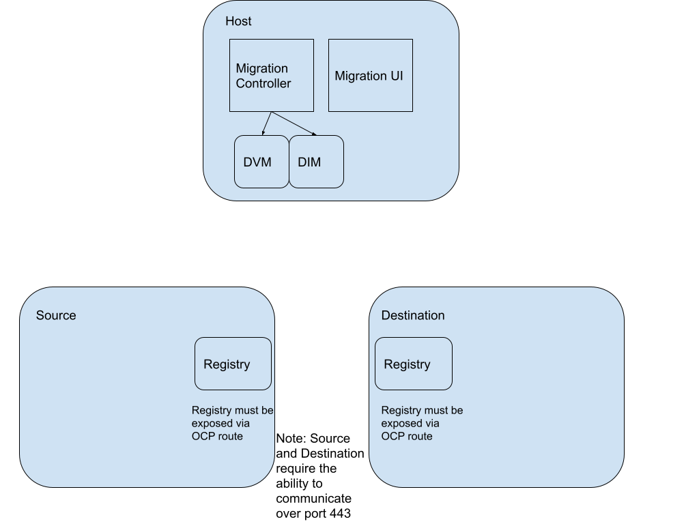
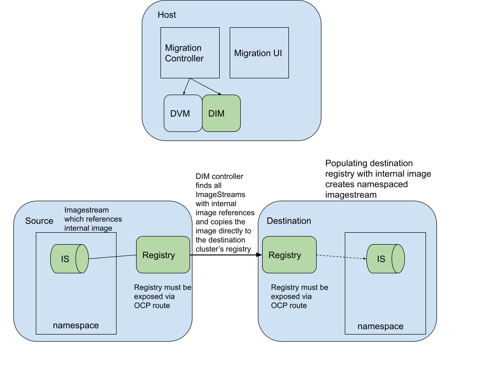
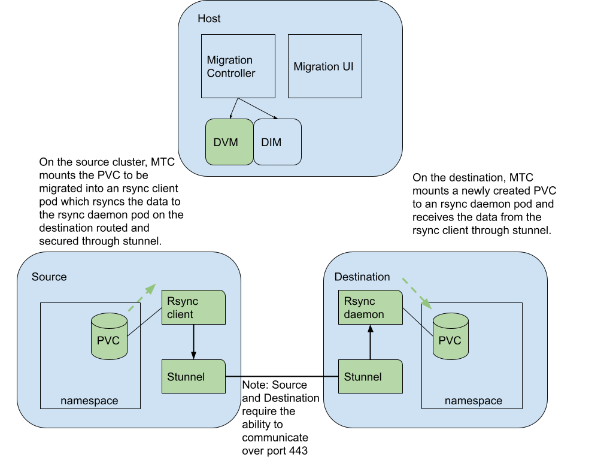

In MTC 1.4.0, a new feature called Direct Migration is available that will yield significant time savings for most customers migrating persistent volumes and/or internal images. Direct Migration enables the migration of persistent volumes and internal images directly from the source cluster to the destination cluster without an intermediary replication repository. This introduces a significant performance enhancement while also providing better error and progress reporting information back to the end-user.

Prior MTC releases only allowed a 2 step backup and restore process when handling images and persistent volumes, which didn't take advantage of potential performance savings in the case of a migration with both the source and destination clusters having network connectivity. The prior process leveraged a filesystem copy tool called Restic integrated with Velero. MTC would need to copy PV and Image data twice: once from the source cluster to the replication repository, and a second time from the replication repository to the destination cluster. This process yielded flexibility for various environments, yet failed to take advantage of the more common case in a migration of direct network connectivity between clusters.

With Direct Migration in MTC 1.4, we are able to take advantage of any environments that have network connectivity between the clusters involved in the migration by handling the migration of PV data and Image data in a new way. Assuming remote clusters have exposed routes to enable external access to the internal registry, MTC will push internal images directly into the internal registry on the destination cluster from the source cluster. Assuming the clusters can communicate over port 443 via OpenShift routes, MTC will directly migrate Persistent Volume data from a source cluster to a destination cluster using a set of Rsync + Stunnel pods which we will describe more below.

## Prerequisites

As mentioned above for direct image migrations, it is important for remote source and destination clusters internal registries be exposed for external network traffic.

- [expose OCP 4 cluster registry](https://docs.openshift.com/container-platform/4.6/registry/securing-exposing-registry.html)
- [expose OCP 3 cluser registry](https://docs.openshift.com/container-platform/3.11/install_config/registry/securing_and_exposing_registry.html)

For direct volume migrations, the source and destination clusters must be able to communicate over port 443 via OpenShift routes. MTC will create a route in each namespace to be migrated on the destination cluster and will be migrating the data by establishing an Rsync connection to this route. This means that the OpenShift routes must be accessible by the source cluster.

The above diagram shows a configuration of 3 clusters running MTC. The Host cluster does not need to be its own cluster and could be the source or the destination cluster.

## Direct Image Migration Details

In direct image migration (DIM), the Migration Controller pod creates a DIM resource that contains a list of namespaces to migrate. The DIM controller then finds all of the imagestreams with internal image references in those namespaces and copies them directly into the destination registry. In order for this to succeed, DIM also ensures the namespace exists on the destination cluster prior to the copy.

The above diagram shows how DIM orchestrates the migration of an imagestream backed by the internal registry directly from the source cluster to the destination cluster.

## Direct Volume Migration Details

For Direct Volume Migration, or DVM, the DVM controller takes in a list of PVCs to migrate and performs a few steps prior to copying the data over. For DVM to work, it is necessary for the source and destination clusters to be able to communicate over port 443 via OCP routes which are created by DVM.

First, DVM sets up the needed configuration configmaps and secrets across all the namespaces to migrate and then creates transfer pods on the destination cluster in each namespace to be migrated. The transfer pods on the destination include both rsyncd and stunnel containers. Stunnel is used to open up a communication tunnel between the source and destination. The rsyncd container has volume mounts to all PVCs in the namespace which are to be migrated. An rsync client pod is created on the source (1 per PVC) to then rsync the data via the stunnel route.

The above diagram shows how MTC orchestrates a direct volume migration by standing up a set of rsync and stunnel pods to directly migrate the PV data from the source to the destination cluster.

## Conclusion

In MTC 1.4.0, users can expect significant performance enhancements when direct migration is taken advantage of. The direct migration feature also grants the user more granular progress and error reporting back in the user interface to make it easier to debug what went wrong with the migration.
