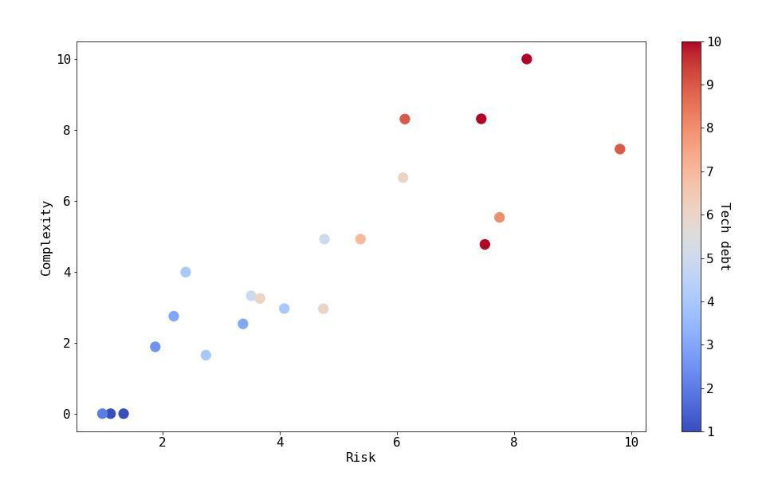

As a software developer, technical debt is all those little things that you feel are hampering the efficiency of your coding. These are the issues that you (or your manager) choose to handle next time, because of the urgency of the current release. But sometimes, by the time you get to them, they have become so big you do not know where to start solving them. The difficult part is that decisions we make regarding technical debt have to balance between short term and long term implications of accumulating such debt, emphasizing the need to properly assess and address it when planning development cycles.

In their seminal article from 2012[^1], Nord et al suggest a metric to measure technical debt, based on dependencies between architectural elements. They use this method to show how an organization should plan development cycles while taking into account the effect the technical debt will have on the overall resources required for each subsequent version.

In this post, we demonstrate that not only is technical debt key to making decisions regarding any specific application, it is also important when attempting to prioritize work between multiple applications. Specifically, modernization work. Moreover, we show a method that can be used to not only compare the performance of different design paths for a single application, but also compare the technical debt levels of multiple applications at an arbitrary point in their development life cycle.

The main idea of the aforementioned article is to provide a way to measure technical debt. It is done using a formula that mainly relies on the dependencies between architectural elements in the given application. It is worth noting that the article does not define what constitutes an architectural element or how to identify these elements when approaching an application.

We took a similar approach and devised a method to measure technical debt of an application based on the dependency graph between its classes. The dependency graph is a directional graph _G_ =(_V_, _E_) in which the _V_ = {_c_1, _c_2, ...} is the set of all classes in the application and an edge _e_ = ⟨_c_1, _c_2⟩ ∈ _E_ exists between two vertices if class _c_1 depends on class _c_2 in the original code. We perform multi-faceted analysis on the graph to eventually come up with a score that describes the technical debt of the application. Here are some of the metrics we extract from the raw graph:

1. Average/median outdegree of the vertices on the graph
1. Top N outdegree of any node in the graph.
1. Longest paths between classes

Using standard clustering algorithms on the graph, we identify communities of classes within the graph and measure additional metrics on them, such as:

1. Average outdegree of the identified communities
1. Longest paths between communities

Our hypothesis is that using these generic metrics on the dependency graphs, we can identify architectural issues which represent real technical debt in the original code base. Moreover, by analyzing dependencies on these two levels, class and community, we give a broad interpretation of what an architectural element is in practice, without attempting to formally define it.

To test this method, we created a data set of over fifty applications from a variety of domains (online retail, financial, automotive, etc…) and extracted the aforementioned metrics from them. We used this data set in two ways. First, we correlated specific instances of high ranking occurrences of outdegrees and long paths with local issues in the code. For example, identifying god classes by their high outdegree[^2]. This proved efficient and increased our confidence level that this approach is valid in identifying local technical debt issues. The second approach was to try and provide a high level score that can be used not only to identify technical debt in a single application but to also be able to compare technical debt between applications, and to use it to help prioritize which should be addressed and how. To do that we introduced three indexes:

1. Complexity — represents the effort required to add new features into the software.
1. Risk — represents the potential risk that adding new features has on the stability of existing ones.
1. Overall Debt — represents the overall amount of extra work required when attempting to add new features.

We manually analyzed the applications in our data set, also employing the expert knowledge of the architects in charge of actively developing them, and scored each application’s complexity, risk, and overall debt on a scale of 1-5. We used these benchmarks to train a machine learning model which correlates the values of the extracted metrics with the indexes and normalizes them to a score of 0-100. At this point, we can use this trained model to issue a score per index for any new application we encounter which allows us to analyze entire portfolios of applications, and compare them both to one another and to our pre-calculated benchmark. The following graph depicts a sample of 21 applications demonstrating the relationship between the aforementioned metrics.

The overall debt levels were then converted into currency units, depicting the level of investment required to add new functionality into the system, e.g. only $0.1 of every $1 of any investment will go into innovation due to architectural technical debt. This is intended to help organizations build a business case for handling and removing architectural technical debt from their applications.

We have shown a method to measure technical debt of an application based on the dependencies between its classes. We have successfully used this method to both identify local issues which cause technical debt as well as providing a global score, comparable between applications. By employing this method, organizations can successfully assess and manage the technical debt in their software which will lead to a better overall decision making process.

---

_**Bio:** Ori Saporta co-founded vFunction and serves as its Systems Architect. Prior to founding vFunction, Ori was the lead Systems Architect of WatchDox until its acquisition by Blackberry, where he continued to serve in the role of Distinguished Systems Architect. Prior to that, Ori was a Systems Architect at Israeli’s Intelligence Core Technology Unit (8200). Ori has a BSc in Computer Engineering from Tel-Aviv University and an MSc in Computer Science from the same institute for which his thesis subject was “Testing and Optimizing Data-Structure Implementations Under the RC11 Memory Model."_

[^1]: Nord, Robert L., et al. "In search of a metric for managing architectural technical debt." _2012 Joint Working IEEE/IFIP Conference on Software Architecture and European Conference on Software Architecture_. IEEE, 2012.
[^2]: [Wikipedia: God object](https://en.wikipedia.org/wiki/God_object).
